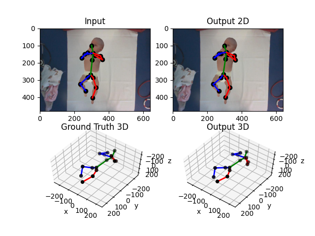

# 3D Infant Pose Estimation from RGB Video using Deep Learning

This [codebase](https://github.com/simonEllershaw/3DInfantPoseEstimation/edit/master/README.md) was produced during my MSc Individual Project. It contains a Pytorch implementation of the 3D infant pose estimation model that was developed over the course of the project. This was shown to achieve state-of-the-art-results on the MINI-RGBD benchmark dataset; AJPE 28.47mm, PCKh 1.0 65.20%, PCKh 2.0 88.99%. The report also contained within this repo outlines the methology and finding in detail. A video of the output of the model on the test set of the MINI-RGBD dataset is also available [here](https://www.youtube.com/watch?v=rvivVQzxUIc)

## Download

The codebase presented here was designed as a rough and ready iterative playground for the design of the model. Hence optimisations and considerations for the ease of use by others is limited. Instead this repo serves as a baseline for others wishing to expand upon the methods outlined in the report

However, if one wishes to download the relevant sources the following needs to be done:

1. Download this repo
1. Download the SavedModels.zip from [OneDrive](https://imperiallondon-my.sharepoint.com/:u:/g/personal/sje116_ic_ac_uk/EflqDbI3plVKhFf2FFG4i-UBuIdF82krOQfTzMK_Wje3CQ?e=ARWabg). Unzip and place under the project root
1. Download the MPI_INF_3DHP, MPII and MINI-RGBD datasets and update the Datasets/Utils/Config.py with their locations. If you have access to Imperial's Bitbucket this step is not necessary and the config is setup correctly.

## Running

As mentioned this repo was designed with experimentation in mind rather than a quickStart procedure. The implementation section of the pdf report would be a good starting point for anyone intrested in using this codebase to explore the model's performance. However, the following can be done with no alteration to the code base

1. All classes in DataSets.Concrete can be run and sample outputs from the dataset viewed in Images/
2. PoseEstimation/Core/Evaluation.py can run evaluation metrics and visualise outputs of the full model on the MINI-RGBD dataset
3. PoseEstimation/Core/Trainer.py  and FasterRCNN/Trainer.py can run training protocols for their respective models.

